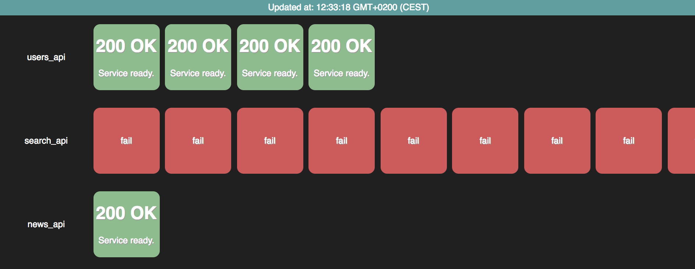

# ec2dashboard
Dashboard that shows healthcheck status of your ec2 instances.

This is how it can look in you browser:

## Features

* Using AWS javascript SDK it fetches your EC2 instances every n seconds.
* Every instance can be clicked and you'll be redirected to the healthcheck page of the specified instance

## Requirements

* Browser. I tested it with `Chrome Version 60.0.3112.101 (Official Build) (64-bit)`.
* Configure CORS headers in your APIs (for example `Access-Control-Allow-Origin: http://localhost`).
* Because this is a browser app make sure that this dashboard is in a safe place and can't be accessed by anyone.
  * If you display the dashboard on a big screen in the office then disable all developer tools in your browser.

## Installation

* Clone this repository.
* Copy `config.dist.js` and rename it to `config.js`
* Update the values inside of your `config.js`
* Open `index.html` in your browser
